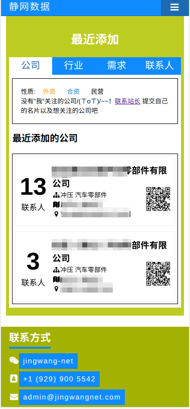

# 静网数据前端&设计

## 预览
> [查看全部 预览图](https://github.com/jingwangnet/jingwangnet-frontend/tree/master/screen_shot  "查看所有预览图")  
> ### 首页预览
>
> 
> 

## 布局

> ### index.html
> * header
>    * h1
>    * p
>
> * div.topnav
>    * a.\#id
>    * nav.\#nav
>        * a \* 4
>    * a.icon
>        * i.fa
>
> * main 
>
>    * div.statu
>      * img
>      * div.data-wrap
>        * h2
>        * div.data
>          * div.data-item \* 4
>
>    * div show
>
>      *  div.show-item * 4
>        * h2 
>        * ul
>          * li \* 2
>
>    * div.recent
>
>      * h2 
>
>      * div.tab-wrapper
>
>        * div .tab
>
>          * button.tablinks \#defaultOpen
>          * button.tablinks \* 3
>
>        * div.tabcontent#Company
>
>          * div.aside
>
>          * h3
>
>          * card-wrapper
>
>            * **div.card \* N**
>
>              * card-inner
>
>                * div.card-front
>
>                     * div.card-ront-aside
>                         *  span.num
>
>                     * ul.company-info
>                         * **li.card-title** 
>                         * **li \* 3**
>
>        * div.tabcontent#Industry
>
>          * div.aside
>
>          * h3
>
>          * div.card-wrapper
>
>            * **div.card \* N**
>
>              * div.card-inner
>
>                * div.card-front
>
>                  * div.card-front-aside
>
>                    * span.num
>
>                  * ul.company-info
>
>                    * **li.card-title** 
>
>                    * **li \* 1**
>
>        * div.tabcontent#Need
>
>          * div.aside
>          * h3
>          * div.card-wrapper
>            * **div.card \* N**
>              * div.card-inner
>                * div.card-front
>                  * div.card-front-aside
>                    * span.num
>                  * ul.company-info
>                    * **li.card-title** 
>                    * **li \* 1**
>
>        * div tabcontent#Contacter
>
>          * div.aside
>
>          * h3
>
>          * div.card-wrapper
>
>            * **div.card \* N**
>
>              * div.card-inner
>
>                * div.card-front
>
>                  * div.card-front-aside
>                    * img 
>                  * ul.company-info
>                    * li.card-title
>                    * **li \* 4 **
>
>                * div.card-back
>
>                  * ul.person-info
>                    * li.card-title
>                    * **li \* 3 **
>                  * ul.company-info
>                    * li.card-title
>                    * **li \* 4 **
>
>                  
>
> * footer
>
>    * contact
>      * h3
>      * nav
>        * ul
>          * **li \* 4**
>
> 

